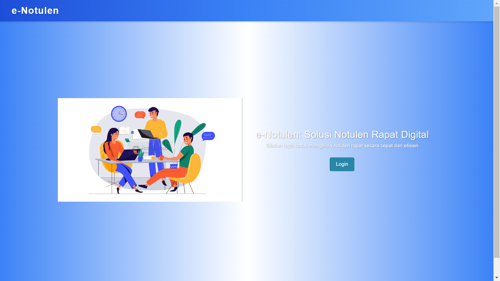
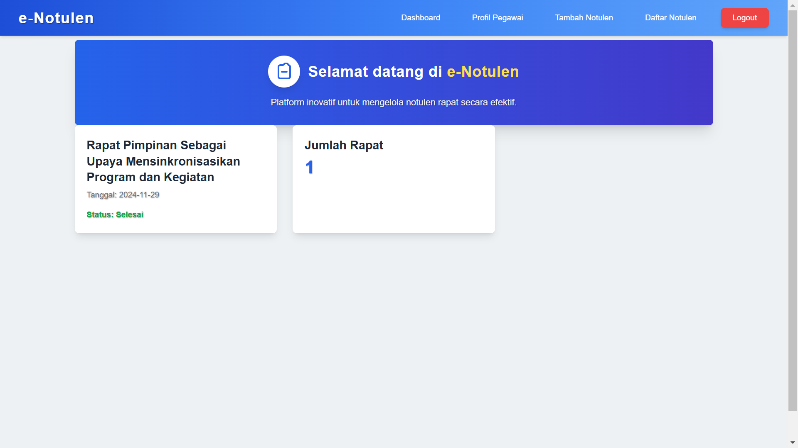
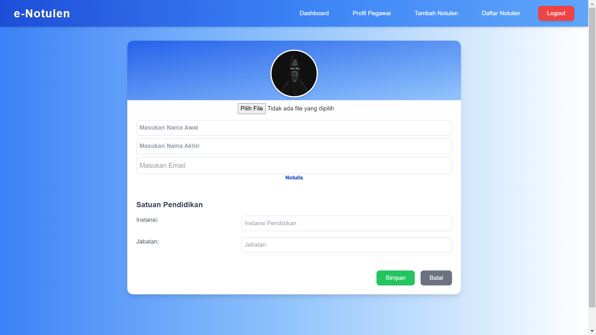
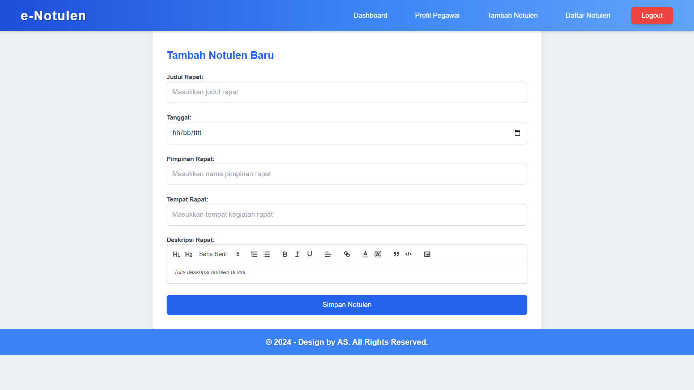
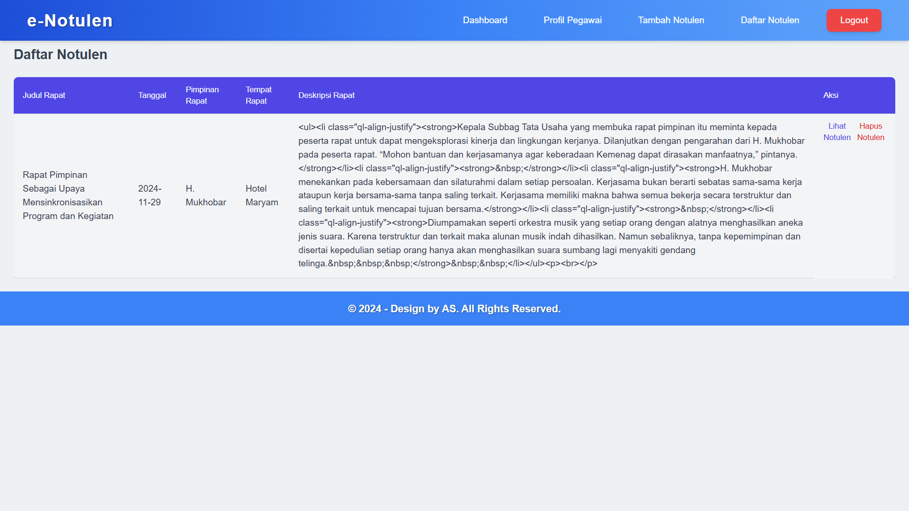
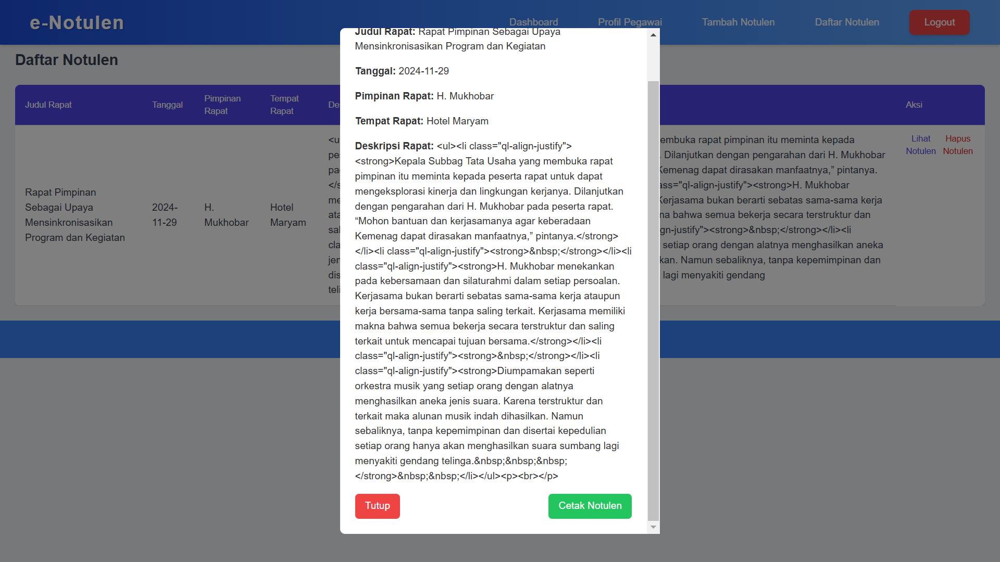

# 📋 e-Notulen Berbasis Web
Saya membuat e-Notulen sebagai pencatatan notulen rapat berbasis web yang membantu meningkatkan efisiensi pengelolaan dan pencatatan hasil rapat secara digital di satuan pendidikan.

## 🎨 Teknologi yang Digunakan
- **Frontend:**
  - React.js: Library JavaScript untuk membangun antarmuka pengguna (UI) yang interaktif.
  - TailwindCSS: Framework CSS utility-first untuk desain yang responsif dan cepat.
  - React Quill: Rich text editor untuk aplikasi React, memungkinkan pengguna untuk menulis teks dengan format yang efisien.

## ✨ Fitur Utama
- Halaman Login
Autentikasi pengguna dengan nama pengguna dan kata sandi.
- Dashboard
Menampilkan data notulen secara ringkas dan terorganisasi.
- Profil
Pengguna dapat mengedit informasi pribadi, termasuk nama, email, dan avatar.
- Form Notulen
Memudahkan pengguna dalam mencatat hasil rapat secara langsung.
- Daftar Notulen
Menyediakan daftar seluruh notulen yang telah dibuat untuk memudahkan pengelolaan.
- Cetak Notulen
Notulen dapat diunduh atau dicetak dalam format PDF untuk kebutuhan dokumentasi.

## 📸 Tangkapan Layar
* Halaman Depan

* Dashboard

* Profil Pengguna

* Form Notulen

* Daftar Notulen

* Cetak Notulen

